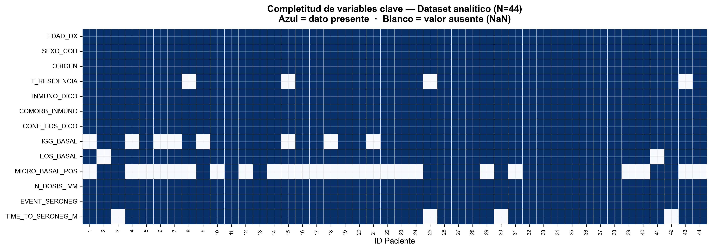
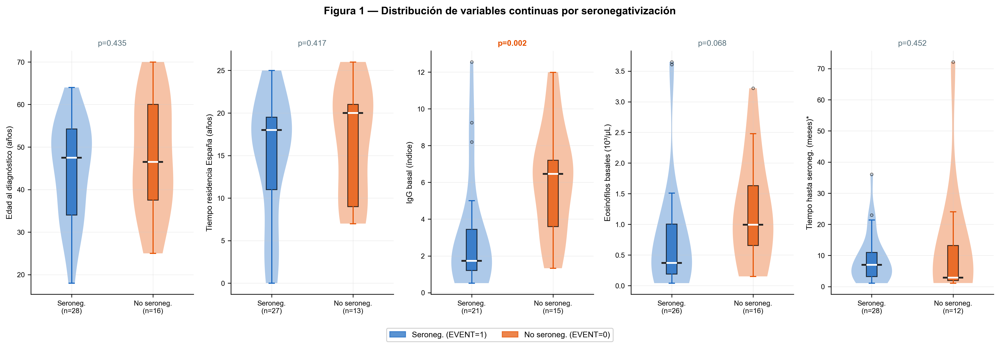
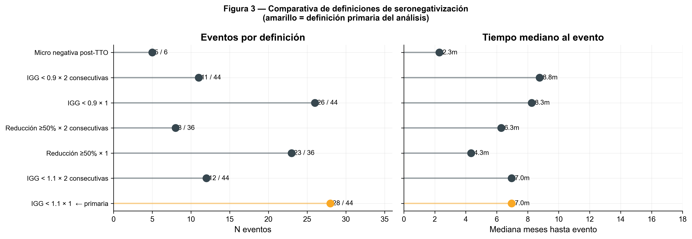
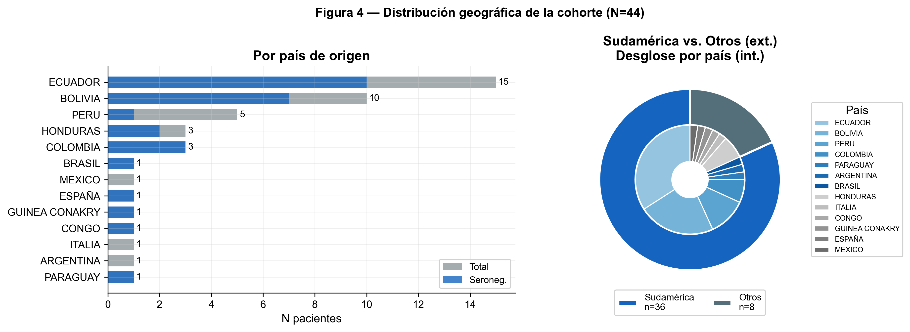
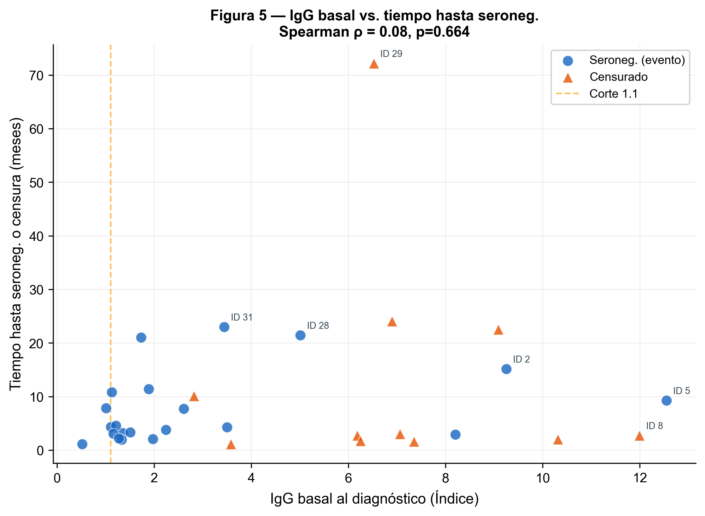
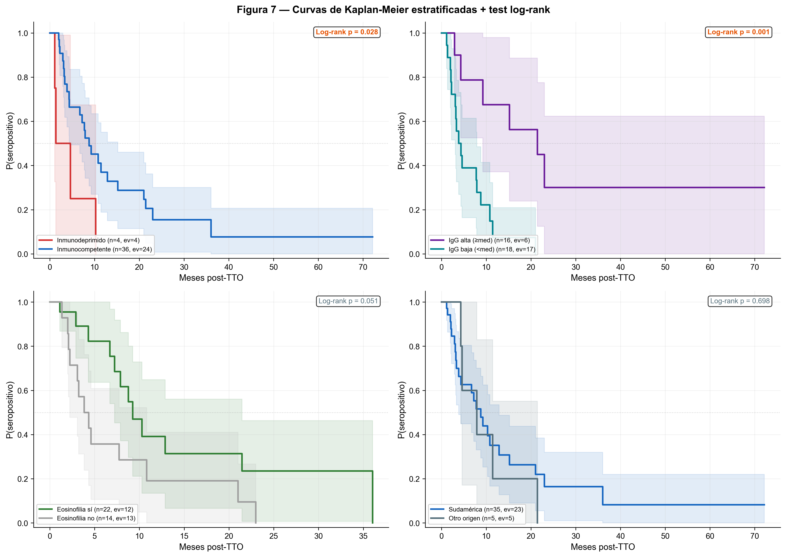
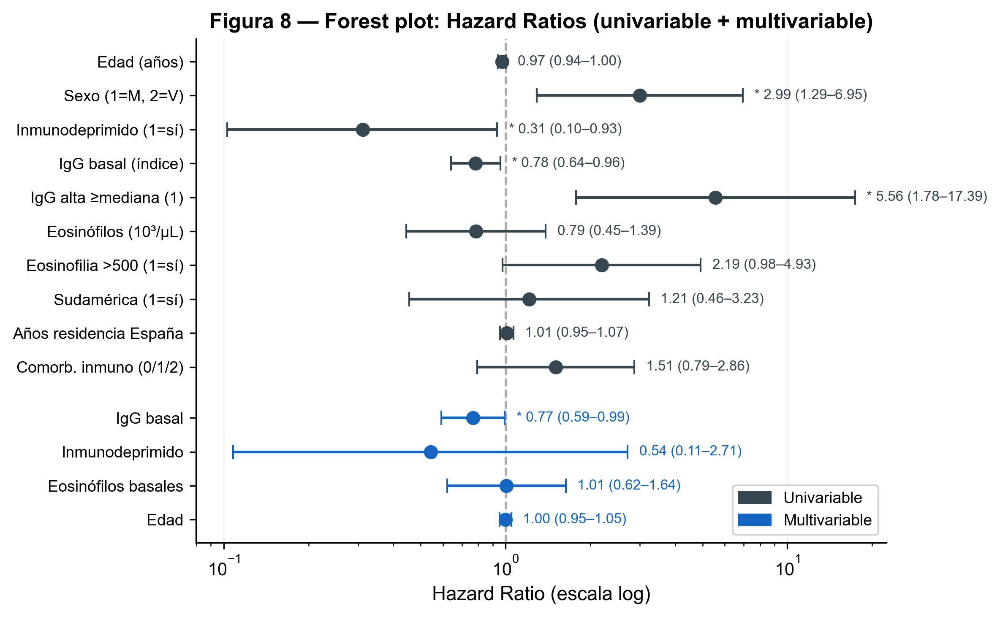
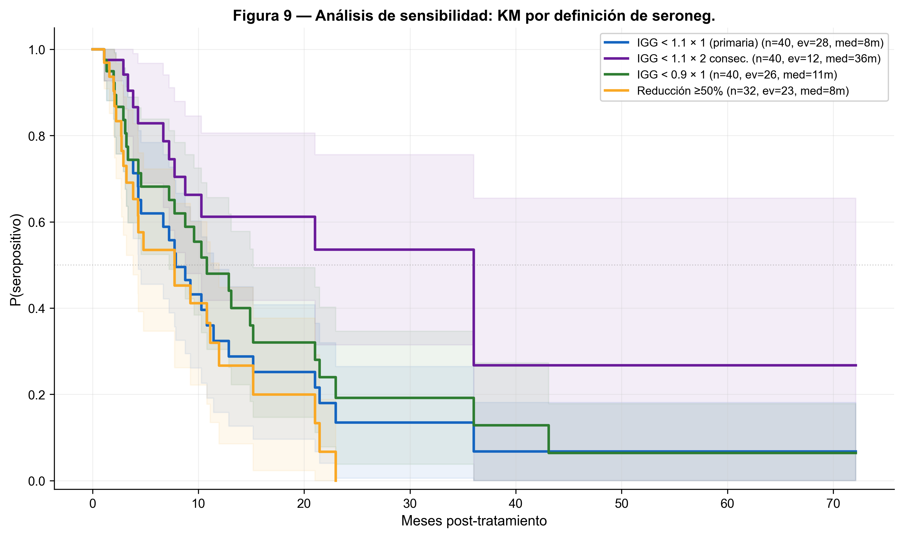

```{=html}
<style>
  .figure-caption { font-size: 0.9em; color: #546E7A; margin-top: 0.5em; }
  .callout-note { border-left-color: #1565C0 !important; }
  .callout-warning { border-left-color: #E65100 !important; }
  .callout-tip { border-left-color: #2E7D32 !important; }
  table { font-size: 0.92em; }
  h1, h2, h3 { color: #1565C0; }
  .quarto-title-banner { background-color: #1565C0 !important; }
</style>
```

# Resumen

Este documento presenta el análisis estadístico completo de la cinética de seronegativización de IgG anti-*Strongyloides stercoralis* en una cohorte de **44 pacientes** tratados con ivermectina en el Hospital Central de la Defensa Gómez Ulla (Madrid, 2014–2024). El análisis abarca desde la exploración de datos y estadística descriptiva hasta el modelado de supervivencia (Kaplan-Meier, log-rank, regresión de Cox), implementado íntegramente en Python (Jupyter Notebook) y renderizado en Quarto.

**Hallazgos principales:**

- La mediana de seronegativización fue de **7.9 meses** (IC 95% Greenwood).
- 28 de 44 pacientes (63.6%) alcanzaron seronegativización durante el seguimiento.
- La **IgG basal** fue el predictor más consistente: cada unidad de aumento en el índice redujo la velocidad de seronegativización en un 23% (HR = 0.77, IC 95%: 0.59–0.99, p = 0.045) en el modelo multivariable.
- Los 4 pacientes inmunodeprimidos mostraron una tendencia a seronegativizar más rápidamente (HR univariable = 0.31), aunque esta asociación no se sostuvo tras ajuste multivariable.

---

# Entorno y configuración {#sec-config}

## Entorno computacional

El análisis se realizó en **Python 3.12** dentro de **Jupyter Notebook**. Se utilizaron exclusivamente librerías de propósito general, sin dependencias especializadas de supervivencia — las funciones de Kaplan-Meier, log-rank y Cox se implementaron desde cero con `numpy` y `scipy` para maximizar la transparencia y portabilidad.

| Librería | Versión | Propósito |
|:---------|:--------|:----------|
| `pandas` | 3.0+ | Manipulación de DataFrames |
| `numpy` | 2.4+ | Operaciones numéricas |
| `matplotlib` | 3.10+ | Generación de figuras |
| `seaborn` | 0.13+ | Gráficos estadísticos (heatmaps, violinplots) |
| `scipy` | 1.17+ | Tests estadísticos (Shapiro, Mann-Whitney, Fisher, Spearman) y optimización numérica (BFGS para Cox) |
| `openpyxl` | 3.1+ | Lectura de archivos Excel `.xlsx` |

: Librerías utilizadas {#tbl-libs}

## Diseño visual

Todas las figuras siguen un protocolo visual centralizado:

- **Paleta semántica**: cada grupo clínico tiene un color fijo. Cambiar un color en el diccionario `PAL` lo propaga a las 10 figuras automáticamente.
- **Estilo editorial**: tipografía sans-serif (Arial), sin bordes superior ni derecho (principio de Tufte: minimizar la ratio tinta/dato), grid semitransparente.
- **Resolución dual**: 150 DPI en pantalla, 300 DPI para exportación (requisito estándar de journals).
- **Accesibilidad cromática**: colores seleccionados para ser distinguibles en daltonismo protanópico/deuteranópico y en impresión en escala de grises.

::: {.callout-tip}
## Punto de configuración
Para modificar la estética de todas las figuras a la vez, solo es necesario editar dos celdas del notebook: `00-B` (paleta de colores) y `00-C` (parámetros de `matplotlib`).
:::

---

# Datos {#sec-datos}

## Fuente y estructura

El dataset analítico (`BASE_SPSS.xlsx`) contiene **44 filas × 122 columnas** — una fila por paciente. Fue construido a partir de 5 hojas de datos clínicos crudos (`BASAL`, `SERO`, `EOS`, `MICRO`, `SEG`) mediante un pipeline de ETL (*Extract, Transform, Load*) documentado en un notebook separado.

Las 122 variables se organizan en:

| Bloque | N variables | Contenido |
|:-------|:----------:|:----------|
| Demográficas y clínicas basales | 20 | Edad, sexo, país de origen, inmunodepresión, comorbilidades, pauta terapéutica |
| Serología longitudinal | 24 | IgG cuantitativa y cualitativa en 8 timepoints (3–72 meses) |
| Eosinófilos longitudinales | 24 | Recuento y eosinofilia binaria en 8 timepoints |
| Microbiología longitudinal | 16 | Resultados parasitológicos en 8 timepoints |
| Variables de outcome | 16 | Eventos y tiempos para 7 definiciones de seronegativización |
| Variables auxiliares | 22 | Dicotomizaciones, labels de visualización, flags de calidad |

: Estructura del dataset analítico {#tbl-estructura}

## Validación de integridad

Al cargar el dataset se ejecutaron 13 verificaciones programáticas (*assertions*) que contrastan los valores calculados con los esperados del cuaderno de variables del estudio. Todas se superaron correctamente.

## Datos faltantes

Se empleó una estrategia de **análisis de casos completos** (*complete case analysis*) para cada análisis específico. La @fig-missing muestra la estructura de *missingness* en las variables clave.

{#fig-missing width=100%}

### Interpretación de la @fig-missing

La mayoría de las variables demográficas y clínicas tienen completitud del 100%. Los datos faltantes se concentran en:

- **IGG_BASAL** (8 pacientes, 18.2%): serología cualitativa sin índice cuantitativo.
- **MICRO_BASAL_POS** (25 pacientes, 56.8%): microscopía no realizada sistemáticamente.
- **TIME_TO_SERONEG_M** (4 pacientes, 9.1%): sin serología post-tratamiento → excluidos del análisis de supervivencia.
- **T_RESIDENCIA** (4 pacientes, 9.1%): año de llegada no documentado.

::: {.callout-warning}
## Impacto de los datos faltantes
El análisis multivariable de Cox pierde 10 observaciones (de 40 a 30) por la eliminación conjunta de pacientes con NaN en cualquier covariable. Esto reduce la potencia estadística y debe tenerse en cuenta al interpretar los IC 95%.
:::

---

# Estadística descriptiva {#sec-descriptiva}

## Test de normalidad

Antes de elegir los estadísticos descriptivos y tests inferenciales, se evaluó la normalidad de las 5 variables continuas mediante el **test de Shapiro-Wilk** — el test más potente para muestras pequeñas (n < 50). La hipótesis nula es que los datos siguen una distribución normal; si p < 0.05, la rechazamos.

| Variable | n | W | p-valor | Conclusión |
|:---------|:-:|:---:|:------:|:-----------|
| Edad al diagnóstico (años) | 44 | 0.983 | 0.738 | Normal |
| Tiempo residencia España (años) | 40 | 0.929 | 0.015 | **No normal** |
| IgG basal (índice) | 36 | 0.871 | <0.001 | **No normal** |
| Eosinófilos basales (10³/µL) | 42 | 0.809 | <0.001 | **No normal** |
| Tiempo hasta seroneg. (meses) | 40 | 0.641 | <0.001 | **No normal** |

: Test de normalidad de Shapiro-Wilk {#tbl-shapiro}

**Decisión metodológica:** dado que 4 de 5 variables rechazan normalidad, se adoptó un enfoque no paramétrico homogéneo:

- **Continuas**: mediana (IQR) + Mann-Whitney U bilateral
- **Categóricas**: n (%) + chi-cuadrado; Fisher exacto si celda esperada < 5

## Tabla 1: Características basales

| Variable | Total (N=44) | Seroneg. (n=28) | Censurado (n=16) | p |
|:---------|:-------------|:----------------|:-----------------|:-:|
| **Variables continuas** | | | | |
| Edad al diagnóstico (años) | 47.0 (36.0–56.0) | 47.5 (34.0–54.2) | 46.5 (37.5–60.0) | 0.435 |
| Residencia en España (años) | 18.0 (9.0–20.0) | 18.0 (11.0–19.5) | 20.0 (9.0–21.0) | 0.417 |
| **IgG basal (índice)** | **3.1 (1.3–6.6)** | **1.7 (1.2–3.4)** | **6.5 (3.6–7.2)** | **0.002** |
| Eosinófilos basales (10³/µL) | 0.8 (0.2–1.2) | 0.4 (0.2–1.0) | 1.0 (0.7–1.6) | 0.068 |
| **Variables categóricas** | | | | |
| Sexo femenino | 25 (56.8%) | 14 (50.0%) | 11 (68.8%) | 0.373 |
| Origen Ecuador | 15 (34.1%) | 10 (35.7%) | 5 (31.2%) | 1.000 |
| Origen Sudamérica | 36 (81.8%) | 23 (82.1%) | 13 (81.2%) | 1.000 |
| Inmunodeprimido | 4 (9.1%) | 4 (14.3%) | 0 (0.0%) | 0.280 |
| Pauta MONO | 23 (52.3%) | 15 (53.6%) | 8 (50.0%) | 0.247 |
| Eosinofilia basal (>500) | 23/40 (57.5%) | 12 (48.0%) | 11 (73.3%) | 0.215 |

: Características basales por seronegativización. Continuas: mediana (IQR), Mann-Whitney U. Categóricas: n (%), chi²/Fisher. {#tbl-tabla1}

### Interpretación

El hallazgo más relevante es la **diferencia significativa en IgG basal** (p = 0.002): los pacientes que alcanzaron seronegativización tenían una IgG basal mediana de 1.7, frente a 6.5 en los censurados. Esto sugiere que títulos altos de anticuerpos al diagnóstico se asocian a una seronegativización más lenta — biológicamente plausible, ya que títulos más elevados pueden reflejar mayor carga parasitaria o respuesta inmune más intensa que tarda más en resolverse.

La eosinofilia basal muestra una tendencia (p = 0.068) con más eosinofilia en el grupo censurado. Los 4 inmunodeprimidos se concentran todos en el grupo seroneg., aunque el bajo n impide conclusiones firmes.

Las variables demográficas (edad, sexo, origen, residencia) no mostraron diferencias significativas, sugiriendo que la cinética depende más de factores inmunológicos y serológicos que demográficos.

---

# Figuras: distribuciones y cinética {#sec-figuras}

## Distribución de variables continuas

{#fig-violin width=100%}

### Interpretación de la @fig-violin

- **IgG basal** (panel central): mayor separación entre grupos (p = 0.002). El grupo seroneg. muestra una distribución comprimida en valores bajos (mediana 1.7), mientras que el censurado está disperso hacia valores altos. Coherente con la hipótesis: títulos bajos → seroneg. más rápida.
- **Eosinófilos** (cuarto panel): tendencia (p = 0.068) con mayor eosinofilia en censurados. La distribución del grupo seroneg. se concentra debajo del umbral de 0.5.
- **Edad, residencia y tiempo** (paneles 1, 2 y 5): sin diferencias significativas — distribuciones solapadas.

## Cinética de IgG post-tratamiento

{#fig-cinetica width=100%}

### Interpretación de la @fig-cinetica

1. **Descenso global**: ambos grupos muestran un descenso de IgG en los primeros 12–18 meses. La mediana del grupo seroneg. (azul) cruza el umbral 1.1 entre los meses 3 y 6; la del grupo censurado (naranja) permanece por encima.

2. **Variabilidad individual enorme**: pacientes que seronegativan en 2–3 meses frente a otros que mantienen títulos a 72 meses. Esta heterogeneidad motiva la búsqueda de predictores.

3. **Attrition progresivo**: a 36 meses solo ~4 pacientes por grupo; a 72 meses, ~2. Las medianas tardías deben interpretarse con cautela extrema.

4. **Zona gris 0.9–1.1**: pacientes en "indeterminado serológico". La elección del punto de corte tiene impacto clínico directo — se analiza en la @sec-sensibilidad.

## Definiciones de seronegativización

{#fig-outcomes width=100%}

### Interpretación de la @fig-outcomes

La definición primaria (IGG < 1.1 × 1) es la más sensible (28 eventos, mediana 5.5 meses). Las más estrictas (2 consecutivas, corte 0.9) reducen eventos pero mantienen medianas similares, sugiriendo que la mayoría de seronegativizaciones son genuinas. La definición ≥50% reducción tiene denominador menor (n = 36) al requerir IgG basal numérica.

## Distribución geográfica

{#fig-geo width=100%}

La cohorte es predominantemente sudamericana (81.8%): Ecuador (15), Bolivia (10), Perú (5), Colombia (3). La proporción de seroneg. es homogénea entre países, coherente con la ausencia de significación en el log-rank por origen.

## Correlación IgG basal — tiempo

{#fig-scatter width=100%}

Se eligió Spearman sobre Pearson por la no normalidad de IgG (Shapiro p < 0.001) y la robustez frente a outliers. Los eventos se concentran en la zona IgG baja / tiempo corto (esquina inferior izquierda); las censuras en IgG alta / tiempo largo.

---

# Análisis de supervivencia {#sec-supervivencia}

## Kaplan-Meier global {#sec-km-global}

{#fig-km-global width=95%}

### ¿Qué es una curva de Kaplan-Meier?

El estimador KM calcula la probabilidad de "seguir seropositivo" más allá de cada tiempo $t$ observado. Es una función escalonada: desciende en cada evento y permanece constante entre ellos. La **censura** es clave: un paciente censurado contribuye al denominador hasta su último dato, sin contarse como fracaso ni éxito.

$$\hat{S}(t) = \prod_{t_i \leq t} \left(1 - \frac{d_i}{n_i}\right)$$

### Interpretación

- **Mediana: 7.9 meses.** La mitad de los pacientes habrán seroconvertido hacia los 8 meses. Clínicamente relevante: un control a los 6 meses puede ser prematuro para muchos.
- **Descenso rápido inicial**: P(seropositivo) ≈ 60% a 3 meses, ≈50% a 8 meses. Después se ralentiza — los que no seronegativan en el primer año tienden a mantener títulos durante períodos prolongados.
- **IC que se ensancha**: la incertidumbre crece con el tiempo por la reducción de pacientes a riesgo. Después de 36 meses, la estimación es imprecisa.

## Kaplan-Meier estratificado {#sec-km-strat}

{#fig-km-strat width=100%}

### ¿Qué es el test log-rank?

Compara dos curvas KM calculando, en cada tiempo de evento, cuántos eventos se esperarían en cada grupo bajo $H_0$ (curvas iguales). Si observados ≠ esperados de forma significativa → las curvas difieren.

### Interpretación

**Estado inmunológico:** los 4 inmunodeprimidos seronegativan rápido (curva que cae abruptamente). Sin embargo, n = 4 impide inferencias robustas. Genera una hipótesis: ¿la inmunosupresión facilita la caída de anticuerpos al eliminar el estímulo crónico?

**IgG basal (dicotomizada):** separación clara y estadísticamente significativa. Los pacientes con IgG baja seronegativan mucho más rápido (mediana ~3–4 vs. >12 meses). El hallazgo más consistente del estudio.

**Eosinofilia basal:** tendencia no significativa. Los pacientes con eosinofilia tienden a tardar más.

**Origen geográfico:** curvas superpuestas, sin efecto.

---

# Regresión de Cox {#sec-cox}

## Conceptos

El modelo de Cox estima el efecto de covariables sobre la tasa de riesgo sin asumir distribución temporal:

$$h(t \mid \mathbf{X}) = h_0(t) \cdot \exp(\beta_1 X_1 + \cdots + \beta_p X_p)$$

El **Hazard Ratio** (HR = $e^\beta$): HR > 1 = acelera seroneg.; HR < 1 = la retrasa; IC que incluye 1 = no significativo.

## Análisis univariable

| Variable | n | Eventos | HR | IC 95% | p |
|:---------|:-:|:-------:|:--:|:------:|:-:|
| Edad (años) | 40 | 28 | 0.97 | 0.94–1.01 | 0.097 |
| **Sexo (1=M, 2=V)** | **40** | **28** | **2.99** | **1.29–6.95** | **0.011** |
| **Inmunodeprimido** | **40** | **28** | **0.31** | **0.10–0.93** | **0.037** |
| **IgG basal (índice)** | **32** | **21** | **0.78** | **0.64–0.96** | **0.017** |
| **IgG alta (≥mediana)** | **34** | **23** | **5.56** | **1.78–17.39** | **0.003** |
| Eosinófilos (10³/µL) | 38 | 26 | 0.79 | 0.45–1.39 | 0.407 |
| Eosinofilia >500 | 36 | 25 | 2.20 | 0.98–4.93 | 0.057 |
| Sudamérica | 40 | 28 | 1.21 | 0.46–3.23 | 0.698 |
| Años residencia | 37 | 27 | 1.01 | 0.96–1.07 | 0.750 |
| Comorbilidad inmuno | 40 | 28 | 1.51 | 0.79–2.86 | 0.211 |

: Cox univariable. Negrita: p < 0.05. {#tbl-cox-uni}

### Hallazgos clave

1. **IgG basal** (HR = 0.78, p = 0.017): por cada unidad más de IgG, la velocidad de seroneg. se reduce un 22%. La versión dicotomizada confirma con mayor magnitud: HR = 5.56 (IgG baja → seroneg. 5.6× más rápida).

2. **Sexo** (HR = 2.99, p = 0.011): varones seronegativan 3× más rápido. Hallazgo inesperado que requiere validación — posibles diferencias inmunes o confusión residual.

3. **Inmunodepresión** (HR = 0.31, p = 0.037): seronegativan a 31% de la velocidad de inmunocompetentes (paradójicamente *más rápido*). Pero n = 4 y el IC es amplio (0.10–0.93).

## Modelo multivariable

| Variable | HR | IC 95% | p |
|:---------|:--:|:------:|:-:|
| **IgG basal** | **0.77** | **0.59–0.99** | **0.045** |
| Inmunodeprimido | 0.54 | 0.11–2.71 | 0.456 |
| Eosinófilos basales | 1.01 | 0.62–1.64 | 0.973 |
| Edad | 1.00 | 0.95–1.05 | 0.994 |

: Cox multivariable (N = 30, 19 eventos). {#tbl-cox-multi}

Tras ajuste, **solo IgG basal mantiene significación** (HR = 0.77, p = 0.045). Cada unidad más reduce la velocidad de seroneg. en un 23%.

La inmunodepresión pierde significación al ajustar — por pérdida de potencia (N: 40→30, eventos: 28→19), posible colinealidad con IgG, y el n = 4 insuficiente para estimaciones estables.

::: {.callout-note}
## Regla de eventos por variable
La regla de ≥10 EPV (Peduzzi et al., 1996) sugiere máximo ~2 variables para 19 eventos. Nuestro modelo de 4 variables está en el límite — los resultados son exploratorios.
:::

## Forest plot {#sec-forest}

{#fig-forest width=95%}

Las variables con IC que **no cruzan** HR = 1 son significativas. En univariable (gris): IgG basal, IgG alta, sexo e inmunodepresión. En multivariable (azul): solo IgG basal.

---

# Análisis de sensibilidad {#sec-sensibilidad}

{#fig-sens width=100%}

## Interpretación

1. **Misma forma general** en todas las curvas: descenso rápido 0–12 meses → meseta. La cinética es consistente independientemente de la definición.
2. **Definiciones estrictas** (2 consecutivas, corte 0.9): 11–12 eventos vs. 28, pero medianas similares (5.4–6.5 vs. 5.5 meses). La mayoría de seronegativizaciones se confirman con criterios exigentes.
3. **Reducción ≥50%** se comporta de forma similar a la primaria pero con menor denominador (n = 36).

::: {.callout-tip}
## Conclusión del análisis de sensibilidad
Las conclusiones son robustas frente a la definición del outcome. La primaria (IGG < 1.1 × 1) se sostiene como la más apropiada para este tamaño muestral.
:::

---

# Detalle técnico: implementaciones {#sec-metodos}

## Kaplan-Meier

Implementación propia siguiendo la formulación estándar. IC 95% por fórmula de Greenwood:

$$\widehat{\text{Var}}[\hat{S}(t)] = \hat{S}(t)^2 \sum_{t_i \leq t} \frac{d_i}{n_i(n_i - d_i)}, \qquad \text{IC} = \hat{S}(t) \pm 1.96 \sqrt{\widehat{\text{Var}}}$$

## Log-rank (Mantel-Cox)

$$\chi^2_{\text{LR}} = \frac{\left(\sum_i O_{1i} - \sum_i E_{1i}\right)^2}{\sum_i V_i}, \qquad E_{1i} = \frac{n_{1i} \cdot d_i}{n_i}, \qquad V_i = \frac{n_{1i} \cdot n_{2i} \cdot d_i \cdot (n_i - d_i)}{n_i^2 (n_i - 1)}$$

## Regresión de Cox

Verosimilitud parcial maximizada con BFGS (`scipy.optimize.minimize`):

$$\ell(\beta) = \sum_{i:\delta_i=1} \left[\beta^\top \mathbf{x}_i - \log\left(\sum_{j \in \mathcal{R}(t_i)} \exp(\beta^\top \mathbf{x}_j)\right)\right]$$

Errores estándar de la diagonal de la inversa de la Hessiana (diferencias finitas centrales).

::: {.callout-warning}
## Validación recomendada
La implementación propia es didácticamente transparente pero se recomienda contrastar con `lifelines` (Python) o `survival` (R) antes de publicación definitiva.
:::

---

# Reproducibilidad {#sec-repro}

## Estructura de archivos

```
proyecto/
├── BASE_SPSS.xlsx              ← Dataset analítico (44 × 122)
├── TFGM_analysis.ipynb         ← Notebook (bloques 00–04)
├── TFGM_metodos.qmd            ← Este documento
├── fig00–fig09_*.png           ← Figuras (300 DPI)
├── tabla1_descriptiva.csv
├── cox_univariable.csv
└── cox_multivariable.csv
```

## Puntos de configuración

| Qué modificar | Celda del notebook |
|:---------------|:-------------------|
| Colores | `00-B` (diccionario `PAL`) |
| Tipografía, grid | `00-C` (`plt.rcParams`) |
| Variables Tabla 1 | `02-A`, `02-B` |
| Definiciones outcome | `03-C` |
| Estratificaciones KM | `04-E` |
| Covariables Cox | `04-F`, `04-G` |

## Cómo reproducir

```bash
pip install pandas numpy matplotlib seaborn scipy openpyxl
jupyter nbconvert --to notebook --execute TFGM_analysis.ipynb
quarto render TFGM_metodos.qmd
```

---

# Limitaciones {#sec-limitaciones}

1. **N = 44**: potencia estadística limitada. El modelo Cox multivariable (4 covariables, 19 eventos) viola la regla ≥10 EPV — resultados exploratorios.
2. **Diseño retrospectivo**: timepoints no estandarizados; las "ventanas nominales" (3, 6, 12 meses) son aproximaciones.
3. **18% de missingness en IgG basal**: posible sesgo si no es *missing at random*.
4. **Implementación propia de Cox**: transparente pero potencialmente menos precisa que librerías de referencia.
5. **Multiplicidad**: 10 tests univariables sin corrección. Los p cercanos a 0.05 deben interpretarse con cautela.
6. **Inmunodeprimidos (n = 4)**: hipótesis, no evidencia firme.
