# Abstract

[PENDIENTE — escribir al final, cuando todos los resultados estén cerrados. Estructura: Problema → Diseño → Endpoint → Métodos → Resultado principal → Conclusión clínica. 250 palabras máximo.]
Quarto

# Introducción

La estrongiloidiasis, causada por el nematodo *Strongyloides stercoralis*, afecta a 310–600 millones de personas en todo el mundo y constituye una de las enfermedades tropicales desatendidas de mayor impacto en poblaciones migrantes y viajeros. A diferencia de otras geohelmintiasis, *S. stercoralis* posee la capacidad de persistir indefinidamente en el huésped mediante un ciclo de autoinfección interna, lo que puede conducir a infección crónica de por vida y, en pacientes inmunodeprimidos, al síndrome de hiperinfección potencialmente letal.

La ivermectina (200 μg/kg, dosis única o múltiple) es el tratamiento de elección para la infección crónica, con una eficacia estimada del 86%. En 2024, la OMS publicó su primera guía recomendando la administración masiva de ivermectina en entornos con prevalencia ≥5%, reflejando un cambio de paradigma en el abordaje global de la enfermedad.

Sin embargo, la monitorización post-tratamiento sigue siendo problemática. La serología IgG es la herramienta de seguimiento más utilizada, especialmente ante la baja sensibilidad de los métodos parasitológicos en infecciones crónicas de baja carga. No obstante, no existe consenso internacional sobre qué constituye una "cura serológica": algunos autores emplean la negativización absoluta del título (IgG por debajo del umbral del ensayo), otros una caída relativa ≥50% respecto al basal, y otros exigen dos determinaciones negativas consecutivas. El rendimiento varía considerablemente entre ensayos comerciales, y la OMS menciona un rango orientativo de 12–18 meses para la serorreversión sin establecer criterios operativos precisos.

Esta ausencia de estandarización tiene consecuencias clínicas directas: sin criterios definidos de curación, no es posible establecer cuándo dar de alta al paciente del seguimiento, con qué frecuencia repetir los controles serológicos, ni qué pacientes requieren un seguimiento más intensivo. Además, no se han identificado factores basales que predigan la velocidad de respuesta serológica, lo que impide individualizar el manejo.

El objetivo de este estudio fue describir la cinética de seronegativización, negativización eosinofílica y negativización parasitológica tras tratamiento con ivermectina en una cohorte de pacientes diagnosticados de estrongiloidiasis en un hospital terciario de Madrid, e identificar las variables basales predictoras de la velocidad de negativización serológica.

# Material y métodos

## Diseño y población

Estudio de cohorte retrospectiva unicéntrica. Se incluyeron todos los pacientes adultos diagnosticados de estrongiloidiasis y tratados con ivermectina en el Hospital Central de la Defensa Gómez Ulla (Madrid, España) entre enero de 2016 y diciembre de 2025 (Figura 1). Los criterios de inclusión fueron: (1) diagnóstico confirmado por serología IgG positiva (índice ≥1.1, ELISA DRG Diagnostics) y/o identificación parasitológica directa; (2) tratamiento con al menos un ciclo de ivermectina; y (3) al menos una determinación analítica de seguimiento post-tratamiento. El estudio fue aprobado por el CEIm [número pendiente]. Se obtuvo exención de consentimiento informado por tratarse de un estudio retrospectivo con datos anonimizados, conducido de acuerdo con la Declaración de Helsinki, el Convenio de Oviedo y la normativa de protección de datos (LOPDGDD 3/2018, RGPD UE 2016/679).

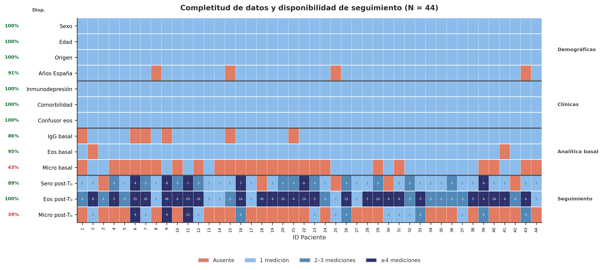
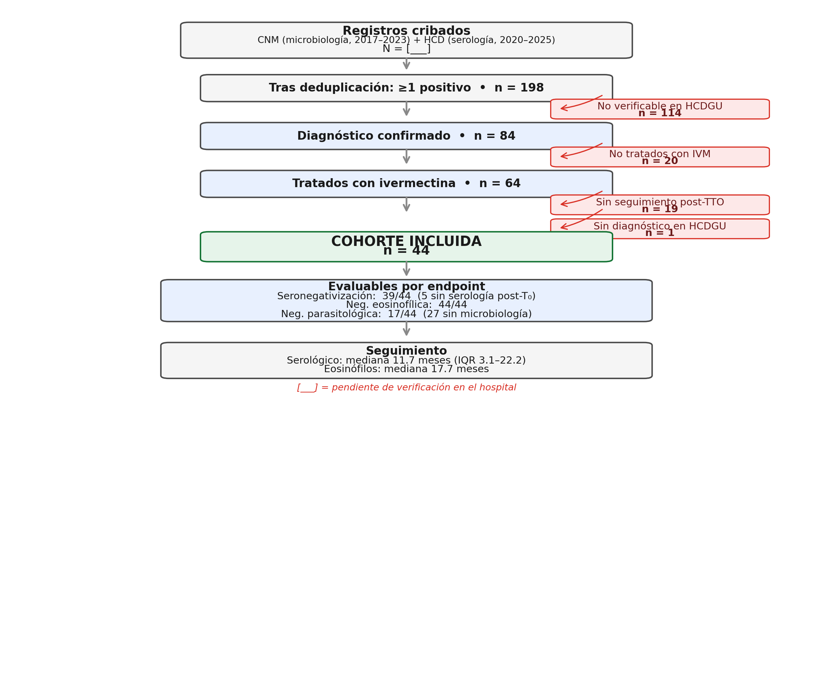

## Recogida de datos

Los datos se extrajeron retrospectivamente de la historia clínica electrónica. Se consultaron dos fuentes: la base del Centro Nacional de Microbiología (CNM, 2017–2023) y la base del hospital (HCD, 2020–2025), fusionadas por número de historia clínica y deduplicadas. El momento cero (T₀) se definió como la fecha de la primera prescripción de ivermectina. Las variables basales se extrajeron como la medición más cercana anterior a T₀.

## Definiciones operativas

Se definieron seis criterios de negativización: seronegativización absoluta (IgG <1.1) simple (×1) y confirmada (×2, dos consecutivas); seronegativización relativa (caída ≥50% del basal) simple y confirmada; negativización eosinofílica (eosinófilos <500 cél/µL); y negativización parasitológica (dos resultados negativos consecutivos, >7 días post-T₀). Se definió recidiva como positivización ≥21 días post-negativización. La seronegativización absoluta ×1 se seleccionó como endpoint primario por ser el criterio más utilizado en la práctica y maximizar el número de eventos observables.

## Análisis estadístico

Las variables continuas se describieron como mediana (IQR) y las categóricas como n (%). Para la estratificación se evaluaron tres puntos de corte por variable (umbral clínico, mediana y percentil 75), seleccionando la mediana como cutpoint primario por producir el balance óptimo entre grupos (Figura 4). El análisis de supervivencia se realizó mediante Kaplan-Meier con IC 95% y test de Log-Rank. Se ajustaron modelos de Cox univariables; el modelo multivariable incluyó un máximo de 2 covariables (regla de Peduzzi: ≥10 eventos/variable), estratificando por sexo al violarse la asunción de proporcionalidad (Schoenfeld p = 0.001). Se utilizó el método de Efron para empates. La trayectoria de IgG se modeló mediante LMM con log(IgG) como variable dependiente e intercepto aleatorio por paciente. Se realizaron tres análisis de sensibilidad: (1) comparación de cuatro definiciones; (2) múltiples cutpoints; (3) exclusión de inmunodeprimidos. Software: Python 3.14 (lifelines, statsmodels). α = 0.05 bilateral.

\newpage

# Resultados

## Características de la cohorte

Se incluyeron 44 pacientes (Tabla 1, Figura 1). La edad mediana fue 47 años (IQR 37–56), con predominio de mujeres (25/44, 57%) y origen andino (82%). Solo 4 pacientes (9%) presentaban inmunodepresión significativa; 18 (41%) tenían comorbilidad relevante (Figura 2).

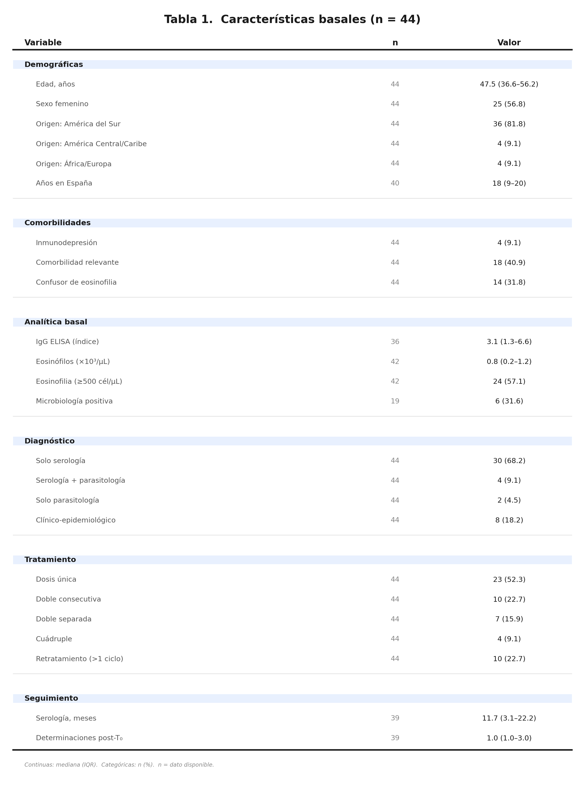{#tbl-basales width=75%}

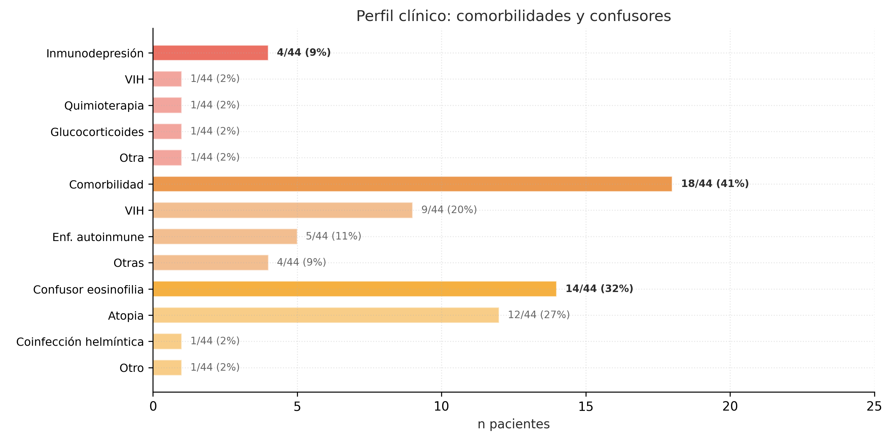{#fig-comorbilidades width=80%}

La mediana de IgG basal fue 3.1 (IQR 1.3–6.6; n=36). Se observó una correlación positiva entre IgG y eosinófilos basales (Spearman ρ = 0.49, p = 0.003, n=34), con los inmunodeprimidos concentrados en valores bajos de ambos marcadores (Figura 3). El 68% fue diagnosticado exclusivamente por serología; el 52% recibió dosis única de ivermectina.

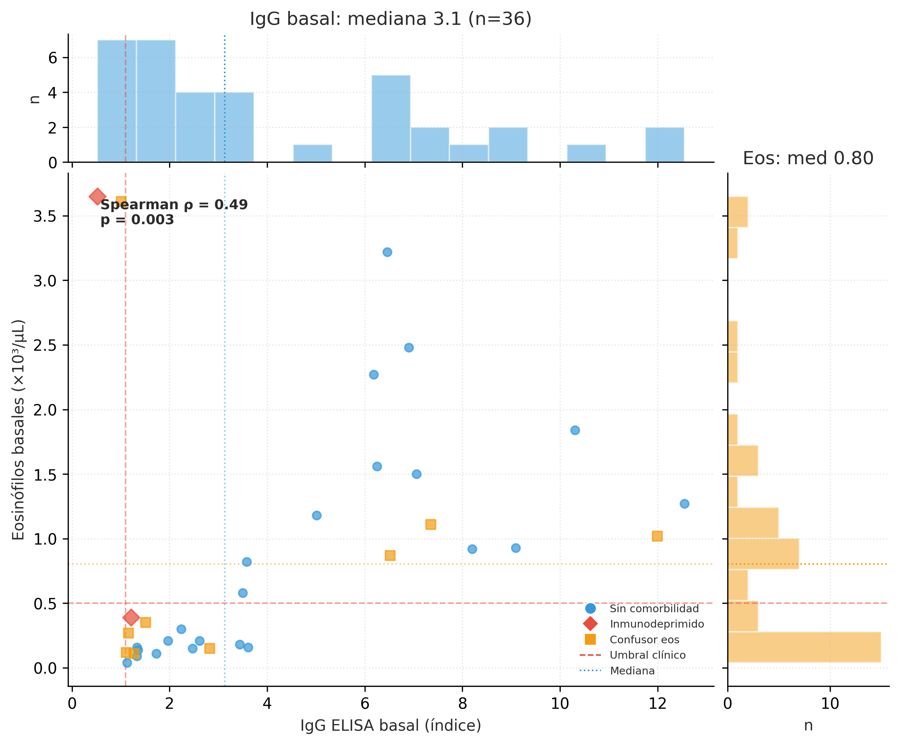{#fig-scatter width=80%}

## Tasas de negativización

La seronegativización absoluta se alcanzó en el 69% de los pacientes evaluables (27/39), con mediana de 267 días (8.8 meses). La negativización eosinofílica fue más rápida (mediana 88 días, 2.9 meses) y universal (44/44). El criterio confirmado (×2) redujo la tasa al 31% (12/39, mediana 500 días). Solo 17 pacientes disponían de microbiología post-tratamiento (Figura 5).

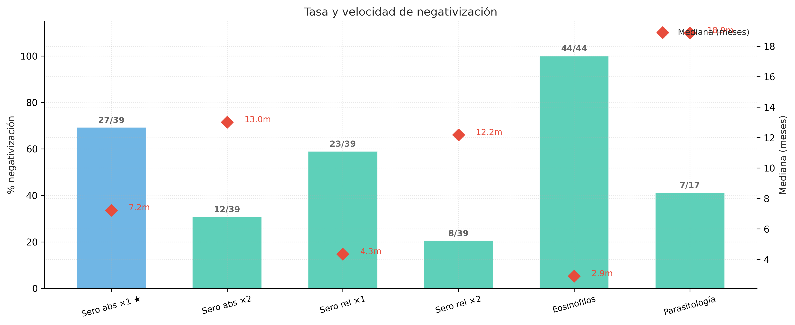{#fig-eventos width=85%}

## Análisis de supervivencia

La mediana de tiempo hasta la seronegativización absoluta fue de 267 días (8.8 meses) (Figura 6). Las cuatro definiciones de negativización produjeron curvas de comportamiento paralelo, indicando conclusiones robustas (Figura 7).

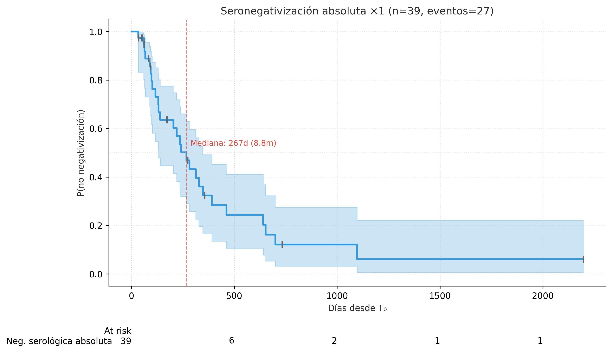{#fig-km-global width=80%}

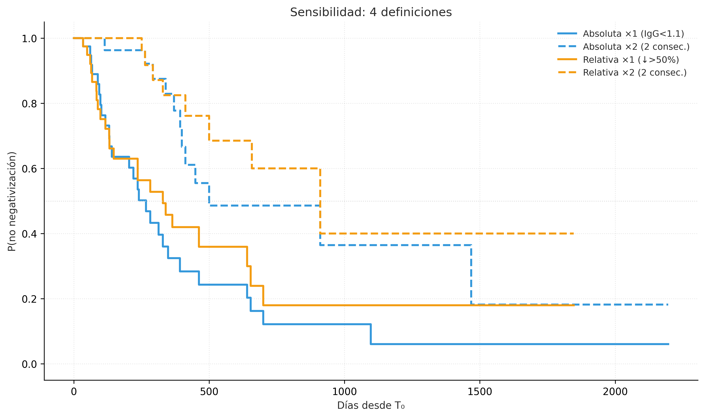{#fig-km-sens width=80%}

La estratificación identificó el título de IgG basal (mediana ≥3.1) como el predictor más discriminante (Log-Rank p = 0.002), seguido del sexo (p = 0.005) y la eosinofilia basal (p = 0.022) (Figura 8).

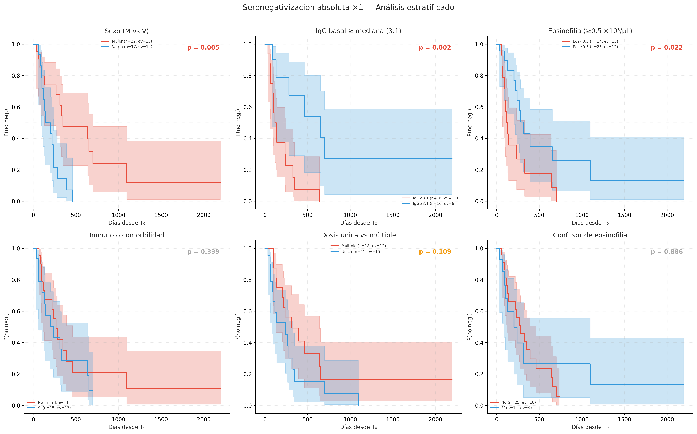{#fig-km-strat width=95%}

## Regresión de Cox

En el análisis univariable, el título de IgG por encima de la mediana se asoció con una negativización cinco veces más lenta (HR 0.19; IC 95% 0.06–0.59; p = 0.004). El sexo masculino se asoció con negativización más rápida (HR 3.29; IC 95% 1.38–7.81; p = 0.007), aunque violó la asunción de proporcionalidad (Schoenfeld p = 0.001). La eosinofilia basal se asoció con negativización más lenta (HR 0.40; IC 95% 0.18–0.90; p = 0.027) (Figura 9).

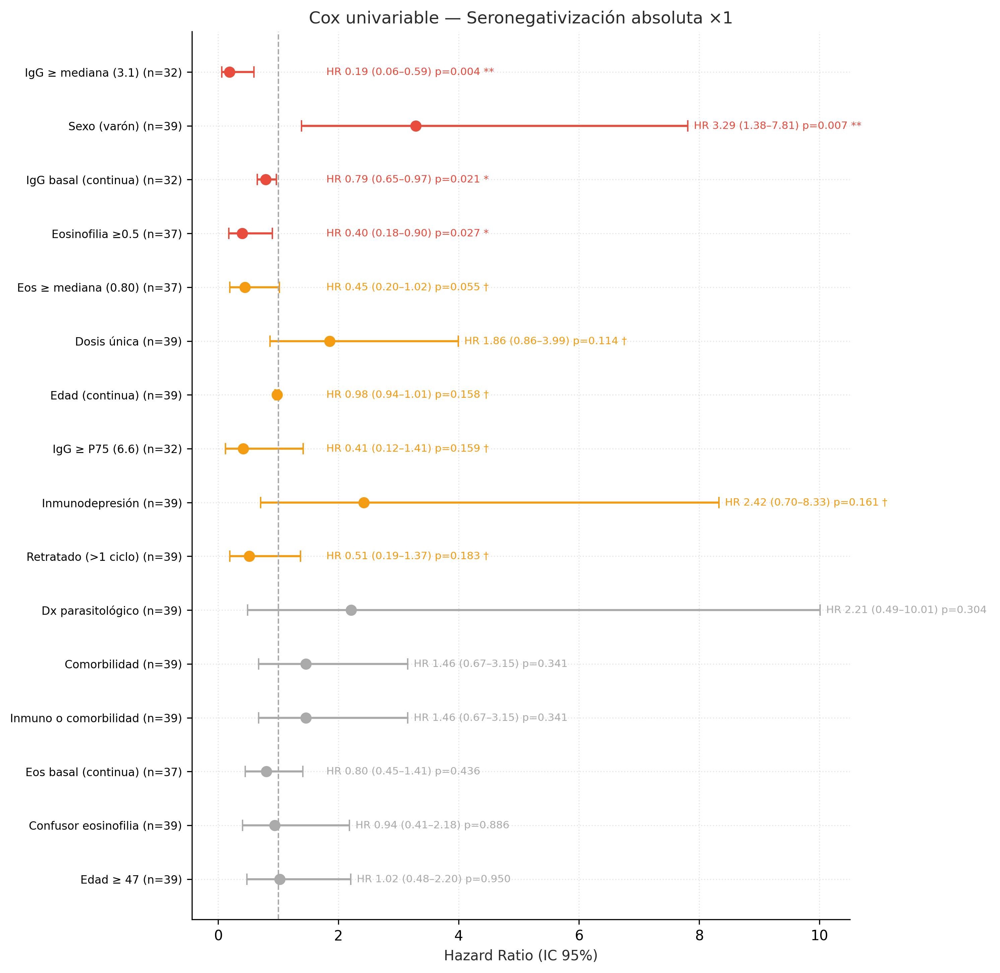{#fig-cox-uni width=85%}

El modelo multivariable, estratificado por sexo y limitado a 2 covariables (27 eventos, regla de Peduzzi), confirmó la asociación independiente de la IgG basal y la eosinofilia con la velocidad de seronegativización (Figura 10). La exclusión de los inmunodeprimidos (SA-3, n=40) no modificó sustancialmente los resultados (variación del HR <0.05 para IgG basal).

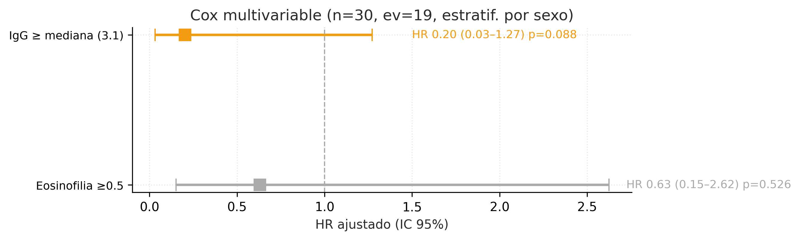{#fig-cox-multi width=75%}

## Trayectoria serológica

El LMM estimó un descenso medio de log(IgG) con el tiempo (pendiente significativa, p < 0.05). El tiempo estimado hasta alcanzar el umbral de negativización fue coherente con la mediana del KM (Figura 11). Los residuos del modelo fueron compatibles con normalidad (Shapiro-Wilk).

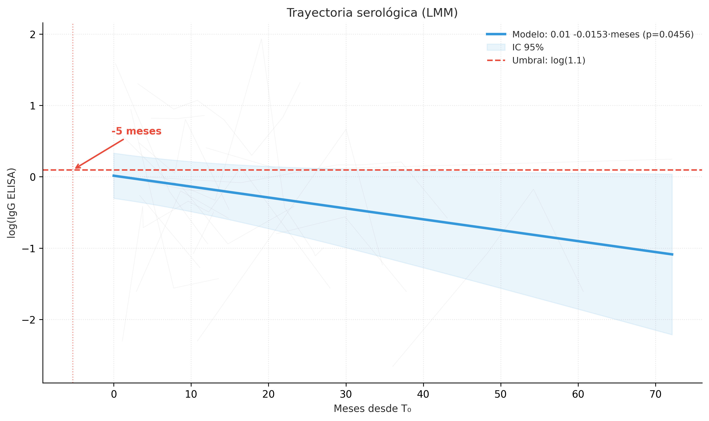{#fig-lmm width=80%}

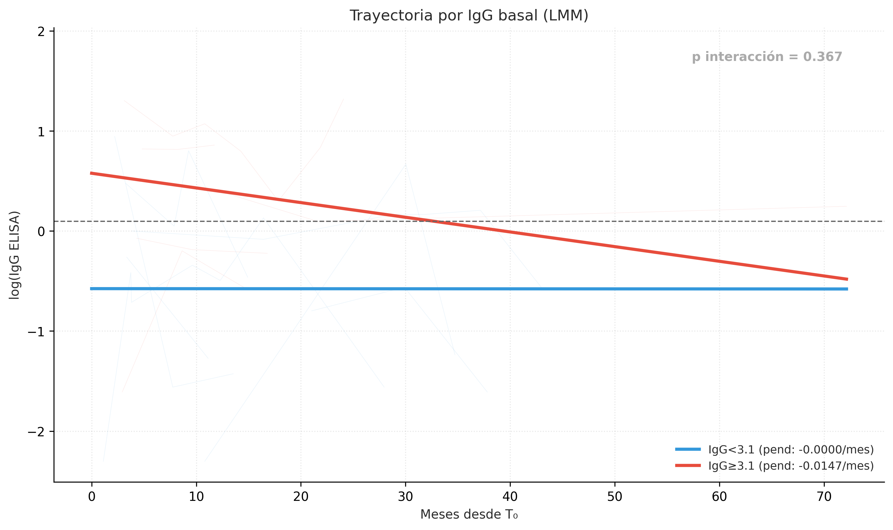{#fig-lmm-int width=80%}

## Recidiva

[Se completará con los datos del render — n recidivas / n negativizados.]

\newpage

# Discusión

La mediana de tiempo hasta la seronegativización absoluta en nuestra cohorte fue de 267 días (8.8 meses), con una tasa del 69% (27/39). El título de IgG basal emergió como el predictor más potente: los pacientes con IgG por encima de la mediana (≥3.1) presentaron una tasa de negativización cinco veces menor (HR 0.19; IC 95% 0.06–0.59; p = 0.004). Esto significa que un paciente con IgG basal elevada negativiza a aproximadamente una quinta parte de la velocidad de uno con IgG baja, una diferencia con implicaciones directas en la planificación del seguimiento.

El sexo masculino se asoció con negativización más rápida (HR 3.29; p = 0.007), pero esta variable violó la proporcionalidad de riesgos (Schoenfeld p = 0.001), indicando un efecto no constante: los varones negativizan más rápido inicialmente, pero la diferencia se atenúa. Por ello se incluyó como variable de estratificación en el modelo multivariable. La eosinofilia basal (≥500 cél/µL) se asoció independientemente con negativización más lenta (HR 0.40; p = 0.027).

La mediana de 8.8 meses es coherente con el rango de 12–18 meses referido por la OMS para la serorreversión; la diferencia se explica porque nuestro criterio (primera IgG <1.1) es menos estricto que la negativización sostenida (criterio ×2: mediana 16.4 meses). La contribución original de este estudio es triple: la comparación sistemática de cuatro definiciones de negativización, la identificación del título de IgG basal como predictor cuantitativo, y la demostración de que la eosinofilia basal, aunque se normaliza antes que la serología (mediana 2.9 meses), predice paradójicamente una negativización serológica más lenta.

Nuestros resultados permiten proponer un esquema individualizado: pacientes con IgG basal baja (<3.1) podrían ser controlados a los 6 meses y dados de alta tras primera serología negativa; pacientes con IgG elevada (≥3.1) requieren controles a los 6, 12 y 18 meses. La persistencia de eosinofilia >6 meses, especialmente sin confusores, debe motivar sospecha de fracaso terapéutico.

Este estudio presenta limitaciones inherentes a su diseño retrospectivo unicéntrico. El tamaño muestral (n = 44, 27 eventos) limita la potencia estadística: el modelo multivariable se restringió a 2 covariables (regla de Peduzzi), y el análisis de la inmunodepresión (n = 4) es meramente exploratorio. La población procede mayoritariamente de la región andina (82%), lo que limita la generalización. Los intervalos de seguimiento no estaban estandarizados (mediana de solo 1 determinación serológica post-T₀). No se dispone de datos de los 40 excluidos, impidiendo descartar un sesgo de selección. El hallazgo sobre el sexo requiere validación en cohortes independientes antes de incorporarse a recomendaciones clínicas.

La seronegativización tras ivermectina en estrongiloidiasis crónica ocurre en una mediana de 8.8 meses. El título de IgG basal es el principal predictor de la velocidad de respuesta. Estos resultados apoyan un seguimiento serológico diferenciado según el perfil basal del paciente. Se necesitan estudios prospectivos multicéntricos que validen estos hallazgos y establezcan protocolos de seguimiento basados en riesgo.

# Referencias

[Se generarán desde references.bib]
